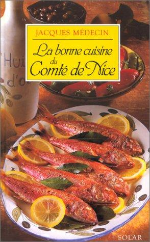

# neo4j-cuisine-nicoise

Graphe neo4j des recettes et ingrédients de la cuisine niçoise. Ce fichier est à charger via ```cypher-shell```. Ce fichier est fait pour
s'entraîner à faire des requêtes cypher et voir un peu comment la cuisine niçoise s'articule autour d'ingrédients clés.

# Ressources

Official tutorial : https://neo4j.com/docs/developer-manual/current/cypher/clauses/match/#match-with-labels

Le livre de référence qui me suit depuis de nombreuses année :




# Requêtes utilitaires

Lister les noeuds orphelins (on ne doit pas en avoir) :

```
MATCH (n) WHERE NOT (n)--() RETURN COUNT(n);
```


# Requêtes exemples

Supprimer les ingrédients peu intéressants : sel et poivre :

```
// Efface le sel
MATCH (ingredient:Ingredient{ nom: 'Sel' })
DETACH DELETE ingredient;
```

```
// Efface le poivre
MATCH (ingredient:Ingredient{ nom: 'Poivre' })
DETACH DELETE ingredient;
```


Les dix ingrédients les plus référencés dans les recette (plus intéressant dans ```cypher-shell```) :

```
MATCH (n)-[r:INGREDIENT_DE]->(s:Recette)
WITH n, count(r) as c
RETURN n, c
ORDER BY c DESC
LIMIT 10;
```

Les ingrédients et leur catégories :

```
MATCH (m:Categorie_Alimentaire )-[r]-(n:Ingredient)
RETURN n,m,r;
```

Les top 3 des catégories alimentaires les plus référencées (celles auxquelles un maximum d'ingrédient sont liés) (plus intéressant dans ```cypher-shell```) :

```
MATCH (n:Ingredient)-[r]->(m:Categorie_Alimentaire)
RETURN m.nom,COUNT(*) AS count
ORDER BY count DESC
LIMIT 3;
```

Les ingrédients des 3 catégories d'aliment les plus fournies :

```
MATCH (n:Ingredient)-[r]->(m:Categorie_Alimentaire)
with m as cat, COUNT(*) AS count
ORDER BY count DESC
LIMIT 3
// on a le top 3 des catégories d'aliments les plus grosses
// on sort les relations et les ingrédients liés
match (i:Ingredient)-[r]->(cat)
return i,r,cat;
```


Les 3 catégories d'ingrédients les plus utilisées dans les recettes :

```

```


Les recettes dont rien ne provient des animaux :

```

```


